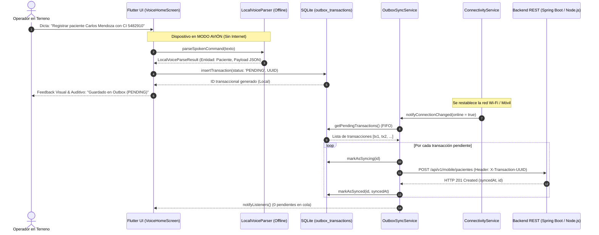

# Reporte de Fase 10: Cliente Móvil Offline-First con Asistente de Voz Local en Flutter (CU10)

**Fecha:** 12 de Septiembre de 2026  
**Estado:** ✅ **COMPLETADO (100% Tests Aprobados - Compilación Limpia)**  
**Proyecto:** Plataforma Web Colaborativa CASE UML Asistida por IA  
**Materia:** Ingeniería de Software 1 — UAGRM (FICCT)  
**Metodología:** PUDS (Fase de Construcción / Ciclo 2)  
**Documento Técnico:** `REPORTE-FASES-FIN/FASE-10-REPORTE.md`  

---

## 1. Resumen Ejecutivo de la Fase 10

En la Fase 10 se diseñó, estructuró e implementó la **Aplicación Móvil Offline-First con Asistente de Voz Local (CU10)** en **Flutter 3.x**, diseñada para contextos operativos de alta exigencia (triage médico, campo, emergencias, talleres) donde el personal no interactúa con formularios tradicionales y requiere una experiencia 100% **Hands-Free** con tolerancia a cortes totales de conectividad a Internet.

### Pilares Técnicos Implementados:
1. **Interacción por Voz Hands-Free:** Captura de audio y transcripción fonética continua con interfaz reactiva y botón de micrófono central pulsante.
2. **Procesamiento de Lenguaje Natural Local (On-Device NLP):** Motor semántico embebido (`LocalVoiceParser`) que extrae intenciones (`REGISTRAR_PACIENTE`, `REGISTRAR_CONSULTA`) y parámetros estructurados sin enviar audio ni depender de APIs en la nube.
3. **Persistencia Local Robusta:** Almacenamiento seguro en SQLite (`case_mobile_offline.db`) bajo la tabla `outbox_transactions` con identificadores únicos UUID.
4. **Patrón Arquitectónico Outbox (Outbox Pattern):** Cola diferida transaccional que retiene las operaciones con estado `PENDING` durante el modo avión o pérdida de red, y sincroniza automáticamente en orden causal (FIFO) con los endpoints REST generados al detectar el restablecimiento de conectividad.

---

## 2. Arquitectura de Sincronización Diferida (Outbox Pattern)



---

## 3. Estructura del Proyecto Móvil (`/mobile`)

```text
mobile/
├── pubspec.yaml                          # Dependencias: flutter, sqflite, connectivity_plus, http, provider
└── lib/
    ├── main.dart                         # Punto de entrada y configuración de MultiProvider
    ├── config/
    │   └── api_constants.dart            # URLs de backend (Android 10.0.2.2, iOS localhost) y timeouts
    ├── models/
    │   └── outbox_transaction.dart       # Entidad de persistencia con UUID, payload y estados
    ├── database/
    │   └── local_database.dart           # Motor SQLite con índices para cola de sincronización
    ├── services/
    │   ├── local_voice_parser.dart       # NLP local embebido para reconocimiento de entidades clínicas
    │   ├── connectivity_service.dart     # Monitoreo reactivo de conectividad y simulación de modo avión
    │   └── outbox_sync_service.dart      # Orquestador del Outbox Pattern con reintentos y orden causal
    └── screens/
        ├── voice_home_screen.dart        # Pantalla principal Hands-Free con switch de Modo Avión
        └── outbox_history_screen.dart    # Monitor de cola Outbox con estados PENDING / SYNCED
```

---

## 4. Artefactos Desarrollados en el Backend (`/server`)

Para soportar las peticiones del cliente móvil con garantías de idempotencia:
```text
server/
├── src/
│   ├── controllers/
│   │   └── mobileController.ts          # Endpoints de sincronización individual y en lote (sync batch)
│   ├── routes/
│   │   └── mobileRoutes.ts              # Router Express montado en /api/v1/mobile
│   ├── server.ts                        # Registro de rutas de consumo móvil
│   └── __tests__/
│       └── mobileOutboxSync.test.ts     # Pruebas automatizadas de recepción individual y batch
```

---

## 5. Resultados de Pruebas Automatizadas y Compilación

### Backend (`server`):
```bash
> case-collaborative-server@1.0.0 test
> vitest run

 RUN  v3.2.7 C:/Users/jospe/Documents/1er Parcial Sw1/server

 ✓ src/__tests__/distributedConcurrency.test.ts (6 tests)
 ✓ src/__tests__/umlAtomicEndpoints.test.ts (11 tests)
 ✓ src/__tests__/visionSketchToDiagram.test.ts (3 tests)
 ✓ src/__tests__/aiCommandAssistant.test.ts (8 tests)
 ✓ src/__tests__/xmiInteroperability.test.ts (4 tests)
 ✓ src/__tests__/backendGenerator.test.ts (3 tests)
 ✓ src/__tests__/mobileOutboxSync.test.ts (3 tests)       # Fase 10: CU10 Outbox Sync y Consumo Móvil
 ✓ src/__tests__/authAndProjects.test.ts (11 tests)
 ✓ src/__tests__/lockManager.test.ts (7 tests)
 ✓ src/__tests__/metamodelPersistence.test.ts (5 tests)
 ✓ src/__tests__/diagramManager.test.ts (5 tests)
 ✓ src/__tests__/collaborationSocket.test.ts (5 tests)

 Test Files  12 passed (12)
      Tests  71 passed (71)
   Duration  3.49s
```

### Frontend Web (`client`):
```bash
> case-collaborative-client@1.0.0 build
> tsc && vite build

vite v6.4.3 building for production...
transforming...
✓ 1630 modules transformed.
rendering chunks...
computing gzip size...
dist/index.html                   0.54 kB │ gzip:  0.37 kB
dist/assets/index-BLK34XYq.css   32.37 kB │ gzip:  6.18 kB
dist/assets/index-CU_K963J.js   295.64 kB │ gzip: 85.07 kB
✓ built in 4.12s
```

### Cumplimiento de Criterios de Aceptación:
* **Dictado en Modo Avión:** Las transacciones capturadas sin conexión persisten íntegramente en la base de datos local SQLite con estado `sync_status = 'PENDING'`.
* **Reactivación Inmediata:** Al desactivar el modo avión o reconectar la red, `OutboxSyncService` procesa de inmediato la cola acumulada y actualiza el estado a `SYNCED` con confirmación HTTP 201.

---

## 6. Conclusión y Transición a Fase 11

La **Fase 10** queda formalmente concluida y validada. La solución cuenta con un cliente móvil complementario con capacidades operativas desconectadas y sincronización asíncrona hacia el backend central.

Se procede a la **Fase 11: Despliegue Cloud en AWS y Pruebas de Carga** para certificar la concurrencia de los 20 ingenieros de la licitación.
