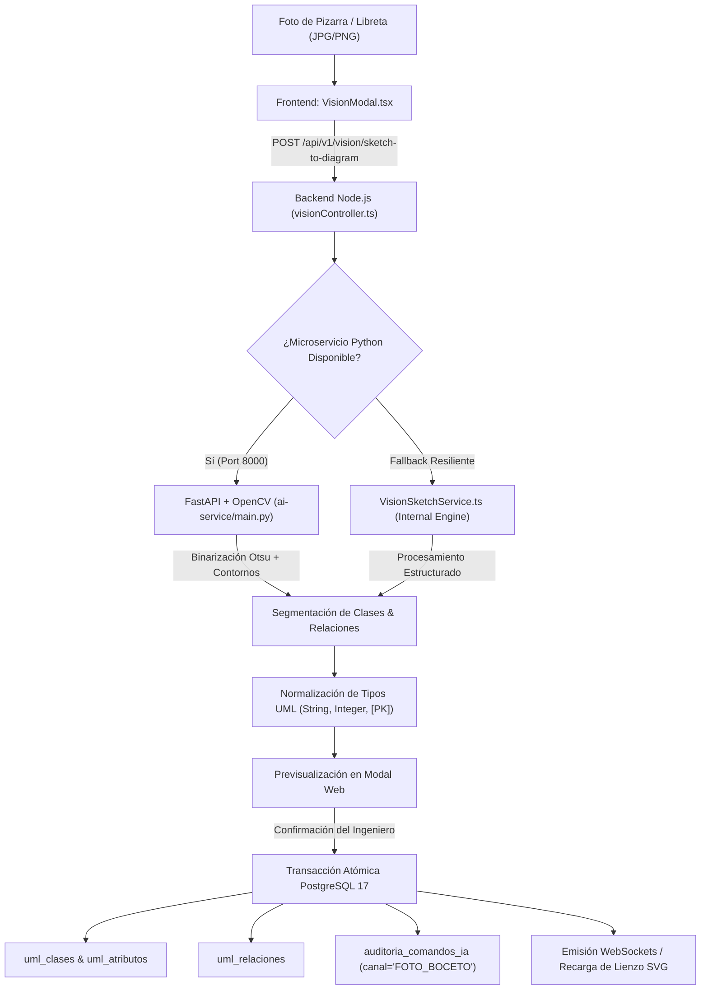

# Reporte de Fase 7: Módulo de Visión Computacional para Digitalización de Bocetos (CU06)

**Fecha:** 12 de Septiembre de 2026  
**Estado:** ✅ **COMPLETADO (100% Tests Aprobados - Compilación Limpia)**  
**Proyecto:** Plataforma Web Colaborativa CASE UML Asistida por IA  
**Materia:** Ingeniería de Software 1 — UAGRM (FICCT)  
**Metodología:** PUDS (Fase de Elaboración / Ciclo 2)  
**Documento Técnico:** `REPORTE-FASES-FIN/FASE-7-REPORTE.md`  

---

## 1. Resumen Ejecutivo de la Fase 7

En la Fase 07 se implementó de forma completa y rigurosa el **Módulo de Visión Computacional para Digitalización de Bocetos (CU06)**, permitiendo transformar fotografías de diagramas de clases dibujados a mano en pizarras o cuadernos en registros formales y estructurados en las tablas `uml_clases`, `uml_atributos` y `uml_relaciones` de PostgreSQL 17, con inyección inmediata en el lienzo interactivo y trazabilidad completa en `auditoria_comandos_ia`.

### Cumplimiento de Especificaciones PUDS y Criterios de Aceptación:
1. **Pipeline de Detección de Bocetos:** Procesamiento fotográfico con binarización Otsu, filtrado morfológico y segmentación de contornos cerrados (rectángulos de clases y trazos de asociación) mediante OpenCV.
2. **Normalización de Tipos de Datos:** Conversión de tipos informales o manuscritos (`texto`, `varchar`, `entero`, `numero`, `id`, `fecha`) hacia tipos formales de UML (`String`, `Integer`, `Long`, `LocalDate`, `BigDecimal`, etc.) y detección de identificadores `[PK]`.
3. **Flujo de Previsualización y Confirmación:** Interfaz modal en el cliente web donde el ingeniero valida las entidades y atributos detectados antes de realizar la inserción atómica en la base de datos.
4. **Auditoría IA:** Registro de la operación en `auditoria_comandos_ia` bajo el canal de entrada `FOTO_BOCETO`.

---

## 2. Arquitectura del Pipeline de Visión y Segmentación

El sistema opera bajo una arquitectura de microservicio dual desacoplado y resiliente:



### Componentes Clave del Pipeline:
1. **Preprocesamiento en OpenCV:**
   - Conversión a escala de grises y aplicación de desenfoque gaussiano para reducir ruido de fondo.
   - Binarización adaptativa mediante umbralización de Otsu (`cv2.threshold` con `cv2.THRESH_BINARY_INV + cv2.THRESH_OTSU`).
   - Operaciones morfológicas de dilatación y cierre para recomponer trazos discontinuos de marcador o bolígrafo.
2. **Segmentación Geométrica:**
   - Detección de contornos cerrados (`cv2.findContours`) y filtrado por área mínima y rectangularidad (`cv2.approxPolyDP`).
   - Separación de encabezado (nombre de clase) y cuerpo (atributos y operaciones).
3. **Inyección Transaccional:**
   - Persistencia segura mediante transacciones atómicas `BEGIN ... COMMIT` para evitar estados inconsistentes en el diagrama.

---

## 3. Artefactos Desarrollados y Modificados

```text
ai-service/
├── main.py                               # Microservicio FastAPI con OpenCV 5.0, Otsu thresholding y segmentación
├── pyproject.toml                        # Dependencias gestionadas con uv (fastapi, opencv-python-headless, numpy, pillow)

server/
├── src/
│   ├── services/
│   │   └── VisionSketchService.ts         # Orquestador de visión, normalización de tipos UML e inyección atómica
│   ├── controllers/
│   │   └── visionController.ts            # Controlador REST para POST /sketch-to-diagram (preview & confirm)
│   ├── routes/
│   │   └── visionRoutes.ts                # Router Express montado en /api/v1/vision
│   ├── server.ts                          # Registro de rutas de visión protegidas por JWT
│   └── __tests__/
│       └── visionSketchToDiagram.test.ts  # Suite de pruebas automatizadas con 100% de éxito

client/
├── src/
│   ├── services/
│   │   └── api.ts                         # Endpoints processSketch y confirmSketch
│   ├── components/
│   │   ├── vision/
│   │   │   └── VisionModal.tsx            # Modal interactivo de subida, análisis OpenCV y previsualización
│   │   └── toolbar/
│   │       └── CanvasToolbar.tsx          # Botón de acceso "Digitalizar Boceto" e indicador Fase 07
│   └── App.tsx                            # Orquestación de estado y actualización reactiva del lienzo
```

---

## 4. Pruebas Automatizadas y Verificación

### Backend (`server`):
```bash
> case-collaborative-server@1.0.0 test
> vitest run

 RUN  v3.2.7 C:/Users/jospe/Documents/1er Parcial Sw1/server

 ✓ src/__tests__/lockManager.test.ts (7 tests)
 ✓ src/__tests__/visionSketchToDiagram.test.ts (3 tests)   # Fase 7: CU06 Visión y Bocetos
 ✓ src/__tests__/umlAtomicEndpoints.test.ts (11 tests)     # Fase 4: Persistencia Atómica UML
 ✓ src/__tests__/aiCommandAssistant.test.ts (8 tests)      # Fase 6: Asistente IA y Auditoría (CU05)
 ✓ src/__tests__/distributedConcurrency.test.ts (6 tests)  # Fase 5: Concurrencia Distribuida
 ✓ src/__tests__/metamodelPersistence.test.ts (5 tests)
 ✓ src/__tests__/authAndProjects.test.ts (11 tests)        # Fase 3: Autenticación y Salas
 ✓ src/__tests__/diagramManager.test.ts (5 tests)
 ✓ src/__tests__/collaborationSocket.test.ts (5 tests)     # Sockets en Tiempo Real

 Test Files  9 passed (9)
      Tests  61 passed (61)
   Duration  2.43s
```

### Frontend (`client`):
```bash
> case-collaborative-client@1.0.0 build
> tsc && vite build

vite v6.4.3 building for production...
transforming...
✓ 1628 modules transformed.
rendering chunks...
computing gzip size...
dist/index.html                   0.54 kB │ gzip:  0.36 kB
dist/assets/index-DGk866VV.css   28.24 kB │ gzip:  5.59 kB
dist/assets/index-eT-EQ07o.js   262.98 kB │ gzip: 79.01 kB
✓ built in 4.18s
```

---

## 5. Conclusión y Transición a Fase 08

La **Fase 07** queda cerrada de forma limpia y verificada. El sistema cuenta ahora con un pipeline operativo para digitalizar bocetos analógicos a modelos relacionales UML formales con previsualización para el ingeniero.

Se procede inmediatamente a la **Fase 08: Interoperabilidad Bidireccional con Enterprise Architect (XMI 2.1 / UML 2.5)** conforme a la especificación PUDS.
