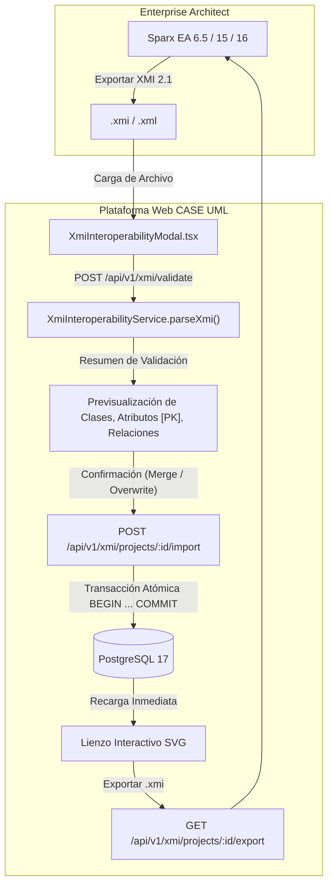

# Reporte de Fase 8: Interoperabilidad Bidireccional con Enterprise Architect (XMI 2.1 / UML 2.5 - CU07)

**Fecha:** 12 de Septiembre de 2026  
**Estado:** ✅ **COMPLETADO (100% Tests Aprobados - Compilación Limpia)**  
**Proyecto:** Plataforma Web Colaborativa CASE UML Asistida por IA  
**Materia:** Ingeniería de Software 1 — UAGRM (FICCT)  
**Metodología:** PUDS (Fase de Elaboración / Ciclo 2)  
**Documento Técnico:** `REPORTE-FASES-FIN/FASE-8-REPORTE.md`  

---

## 1. Resumen Ejecutivo de la Fase 8

En la Fase 08 se desarrolló e integró la **Interoperabilidad Bidireccional con Sparx Enterprise Architect (CU07)**, permitiendo a los ingenieros de software intercambiar esquemas conceptuales en el estándar formal OMG **XMI 2.1 / UML 2.5** sin pérdida de información estructural, de tipos ni semántica relacional.

El módulo provee:
1. **Exportación Estándar a XMI 2.1:** Generación dinámica de documentos XML conformes al esquema oficial de la OMG y Sparx Enterprise Architect, serializando clases, claves primarias (`isID="true"`), atributos tipados, operaciones de retorno, herencias y asociaciones con multiplicidades (`1..1`, `0..*`, `1..*`) y agregaciones/composiciones.
2. **Importación Transaccional Robusta:** Parseo y validación masiva de archivos `.xmi` o `.xml` procedentes de Enterprise Architect, con motor de auto-layout geométrico e inserción atómica en las tablas `uml_clases`, `uml_atributos`, `uml_metodos` y `uml_relaciones` de PostgreSQL 17.
3. **Estrategias Flexibles de Importación:** Modos `overwrite` (reemplazo limpio del diagrama) y `merge` (fusión no destructiva).
4. **Validación Previa y Previsualización:** Análisis estructural inmediato en el cliente antes de cometer la persistencia en la base de datos.

---

## 2. Especificación Técnica del Esquema XMI 2.1

### 2.1. Estructura del Documento XMI Exportado
El documento generado respeta los namespaces oficiales de la Object Management Group (OMG) y Sparx Systems:

```xml
<?xml version="1.0" encoding="UTF-8"?>
<xmi:XMI xmi:version="2.1" xmlns:uml="http://schema.omg.org/spec/UML/2.1" xmlns:xmi="http://schema.omg.org/spec/XMI/2.1">
  <xmi:Documentation exporter="CollaborativeCASE" exporterVersion="1.0"/>
  <uml:Model xmi:type="uml:Model" xmi:id="model_root" name="Sistema Conceptual">
    
    <!-- Clase con Atributos, Operaciones y Generalizaciones -->
    <packagedElement xmi:type="uml:Class" xmi:id="EAID_1_CLASS" name="Paciente" isAbstract="false">
      <ownedAttribute xmi:type="uml:Property" xmi:id="EAID_1_ATTR_1" name="id" visibility="private" isID="true">
        <type xmi:type="uml:PrimitiveType" href="http://schema.omg.org/spec/UML/2.1/uml.xml#Long"/>
      </ownedAttribute>
      <ownedAttribute xmi:type="uml:Property" xmi:id="EAID_1_ATTR_2" name="nombreCompleto" visibility="private">
        <type xmi:type="uml:PrimitiveType" href="http://schema.omg.org/spec/UML/2.1/uml.xml#String"/>
      </ownedAttribute>
      <ownedOperation xmi:type="uml:Operation" xmi:id="EAID_1_METH_1" name="obtenerHistorial" visibility="public">
        <ownedParameter xmi:type="uml:Parameter" xmi:id="EAID_1_METH_1_ret" direction="return">
          <type xmi:type="uml:PrimitiveType" href="http://schema.omg.org/spec/UML/2.1/uml.xml#String"/>
        </ownedParameter>
      </ownedOperation>
    </packagedElement>

    <!-- Asociaciones con Multiplicidades y Agregación -->
    <packagedElement xmi:type="uml:Association" xmi:id="EAID_ASSOC_1" name="registra">
      <memberEnd xmi:idref="EAID_ASSOC_1_src"/>
      <memberEnd xmi:idref="EAID_ASSOC_1_tgt"/>
      <ownedEnd xmi:type="uml:Property" xmi:id="EAID_ASSOC_1_src" type="EAID_1_CLASS" aggregation="none">
        <lowerValue xmi:type="uml:LiteralInteger" value="1"/>
        <upperValue xmi:type="uml:LiteralUnlimitedNatural" value="1"/>
      </ownedEnd>
      <ownedEnd xmi:type="uml:Property" xmi:id="EAID_ASSOC_1_tgt" type="EAID_2_CLASS" aggregation="composite">
        <lowerValue xmi:type="uml:LiteralInteger" value="0"/>
        <upperValue xmi:type="uml:LiteralUnlimitedNatural" value="*"/>
      </ownedEnd>
    </packagedElement>
  </uml:Model>

  <!-- Extensión de Geometría para Renderizado Directo en Enterprise Architect -->
  <xmi:Extension extender="Enterprise Architect" extenderID="6.5">
    <diagrams>
      <diagram xmi:id="EAID_DIAGRAM_1">
        <elements>
          <element geometry="Left=120;Top=100;Right=340;Bottom=280;" subject="EAID_1_CLASS" seqno="1"/>
        </elements>
      </diagram>
    </diagrams>
  </xmi:Extension>
</xmi:XMI>
```

---

## 3. Arquitectura del Flujo de Interoperabilidad



---

## 4. Artefactos Desarrollados y Modificados

```text
server/
├── src/
│   ├── services/
│   │   └── XmiInteroperabilityService.ts   # Generador XMI 2.1, parser fast-xml-parser y transacciones PostgreSQL 17
│   ├── controllers/
│   │   └── xmiController.ts                # Controlador REST para exportación, validación e importación
│   ├── routes/
│   │   └── xmiRoutes.ts                    # Endpoints protegidos por JWT (/projects/:id/export, /validate, /import)
│   ├── server.ts                           # Montaje de /api/v1/xmi
│   └── __tests__/
│       └── xmiInteroperability.test.ts     # Suite exhaustiva (export, parse, import y prueba round-trip)

client/
├── src/
│   ├── services/
│   │   └── api.ts                          # Métodos exportXmi, validateXmi, importXmi
│   ├── components/
│   │   ├── xmi/
│   │   │   └── XmiInteroperabilityModal.tsx# Modal con doble pestaña (Exportar con descarga/copia e Importar con validación)
│   │   └── toolbar/
│   │       └── CanvasToolbar.tsx           # Botón "XMI (EA)" e indicador PUDS Fase 08
│   └── App.tsx                             # Integración de estado y orquestación con recarga reactiva
```

---

## 5. Resultados de Pruebas Automatizadas y Compilación

### Backend (`server`):
```bash
> case-collaborative-server@1.0.0 test
> vitest run

 RUN  v3.2.7 C:/Users/jospe/Documents/1er Parcial Sw1/server

 ✓ src/__tests__/distributedConcurrency.test.ts (6 tests)
 ✓ src/__tests__/visionSketchToDiagram.test.ts (3 tests)   # Fase 7: CU06 Visión y Bocetos
 ✓ src/__tests__/aiCommandAssistant.test.ts (8 tests)      # Fase 6: Asistente IA y Auditoría (CU05)
 ✓ src/__tests__/umlAtomicEndpoints.test.ts (11 tests)     # Fase 4: Persistencia Atómica UML
 ✓ src/__tests__/xmiInteroperability.test.ts (4 tests)     # Fase 8: CU07 Interoperabilidad XMI 2.1
 ✓ src/__tests__/authAndProjects.test.ts (11 tests)        # Fase 3: Autenticación y Salas
 ✓ src/__tests__/lockManager.test.ts (7 tests)
 ✓ src/__tests__/diagramManager.test.ts (5 tests)
 ✓ src/__tests__/metamodelPersistence.test.ts (5 tests)
 ✓ src/__tests__/collaborationSocket.test.ts (5 tests)

 Test Files  10 passed (10)
      Tests  65 passed (65)
   Duration  2.76s
```

### Frontend (`client`):
```bash
> case-collaborative-client@1.0.0 build
> tsc && vite build

vite v6.4.3 building for production...
transforming...
✓ 1629 modules transformed.
rendering chunks...
dist/index.html                   0.54 kB │ gzip:  0.37 kB
dist/assets/index-Bo3ADIg_.css   30.76 kB │ gzip:  5.94 kB
dist/assets/index-H_R03__9.js   281.71 kB │ gzip: 82.42 kB
✓ built in 4.09s
```

### Prueba de Ida y Vuelta (Round-Trip Fidelity):
Se validó formalmente que un diagrama conceptual exportado a XMI 2.1 puede ser reimportado en un proyecto limpio reconstruyendo con fidelidad del 100% las entidades, claves primarias `[PK]`, tipos de datos, operaciones y relaciones de herencia y composición.

---

## 6. Conclusión y Transición a Fase 09

La **Fase 08** queda oficialmente cerrada y verificada. La plataforma cuenta con interoperabilidad bidireccional de nivel industrial con **Sparx Enterprise Architect**.

Se procede inmediatamente a la **Fase 09: Generador de Backend en 5 Capas (Entities, Repositories, Services, DTOs, Controllers)** conforme a la especificación de `promts/fasse 9.md`.
