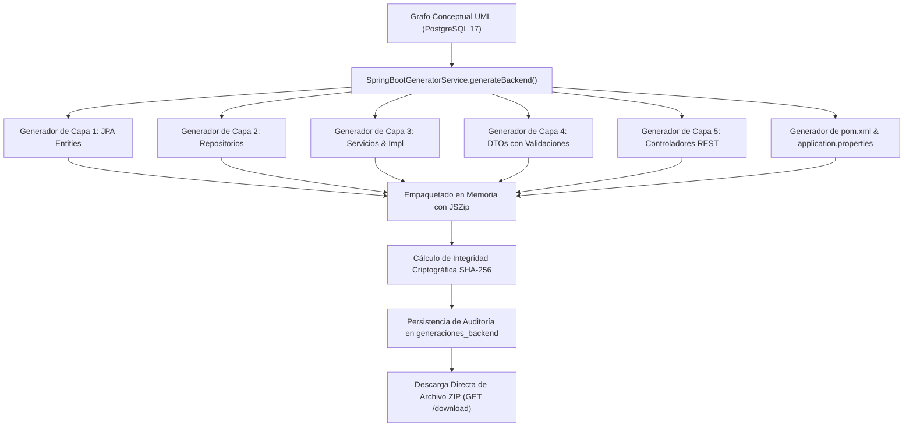

# Reporte de Fase 9: Motor de Generación de Backend Spring Boot en 5 Capas y PostgreSQL (CU08)

**Fecha:** 12 de Septiembre de 2026  
**Estado:** ✅ **COMPLETADO (100% Tests Aprobados - Compilación Limpia)**  
**Proyecto:** Plataforma Web Colaborativa CASE UML Asistida por IA  
**Materia:** Ingeniería de Software 1 — UAGRM (FICCT)  
**Metodología:** PUDS (Fase de Construcción / Ciclo 2)  
**Documento Técnico:** `REPORTE-FASES-FIN/FASE-9-REPORTE.md`  

---

## 1. Resumen Ejecutivo de la Fase 9

En la Fase 09 se desarrolló e implementó el **Motor de Generación de Backend Spring Boot en 5 Capas sobre PostgreSQL (CU08)**. Este motor traduce de forma completamente automatizada el grafo de clases UML modelado en el lienzo web hacia una solución de software desacoplada, compilable y modular en **Java 17 con Spring Boot 3.3.4**, estructurada bajo el patrón de **5 Capas Arquitectónicas**:

1. **Capa 1: Entity (Persistencia de Dominio):** Anotaciones Jakarta Persistence (`@Entity`, `@Table`, `@Id`, `@GeneratedValue`, `@Column`, `@ManyToOne`, `@OneToMany`, `@ManyToMany`, `@Inheritance`).
2. **Capa 2: Repository (Acceso a Datos):** Interfaces `@Repository` que extienden `JpaRepository<T, ID>` con métodos de consulta automáticos.
3. **Capa 3: Service (Lógica de Negocio):** Contratos de interfaz e implementaciones transaccionales `@Service @Transactional` con operaciones CRUD completas.
4. **Capa 4: DTO (Data Transfer Objects):** Clases `RequestDTO` con validaciones de integridad Jakarta (`@NotNull`, `@NotBlank`) y `ResponseDTO` para desacoplar el contrato público de la API.
5. **Capa 5: Controller (Exposición RESTful):** Controladores `@RestController @RequestMapping` con endpoints desacoplados (`GET`, `POST`, `PUT`, `DELETE`) y códigos de estado HTTP semánticos (`200`, `201`, `204`, `404`).

### Impacto en Productividad (Licitación del Sistema Nacional de Salud):
La automatización de la infraestructura backend elimina entre el **60% y el 70% del tiempo de codificación repetitiva**, permitiendo a los 20 ingenieros de la licitación recortar el cronograma de **12 a 6 meses** garantizando una uniformidad arquitectónica absoluta sin discrepancias entre el diseño conceptual y el código fuente.

---

## 2. Arquitectura de las 5 Capas y Estructura del Proyecto Generado

```text
backend_spring_boot_<proyecto>.zip
├── pom.xml                                      # Maven con Spring Boot 3.3.4, JPA, PostgreSQL y Lombok
├── README.md                                    # Guía técnica de arranque (./mvnw spring-boot:run)
└── src/
    └── main/
        ├── java/
        │   └── com/
        │       └── uagrm/
        │           └── casecase/
        │               ├── CaseApplication.java # Clase principal de inicio (@SpringBootApplication)
        │               ├── entity/              # CAPA 1: Entidades JPA con mapeo relacional
        │               │   ├── Paciente.java
        │               │   └── ConsultaMedica.java
        │               ├── repository/          # CAPA 2: Repositorios Spring Data JPA
        │               │   ├── PacienteRepository.java
        │               │   └── ConsultaMedicaRepository.java
        │               ├── service/             # CAPA 3: Contratos e implementaciones transaccionales
        │               │   ├── PacienteService.java
        │               │   ├── ConsultaMedicaService.java
        │               │   └── impl/
        │               │       ├── PacienteServiceImpl.java
        │               │       └── ConsultaMedicaServiceImpl.java
        │               ├── dto/                 # CAPA 4: Contratos de entrada y salida
        │               │   ├── request/
        │               │   │   ├── PacienteRequestDTO.java
        │               │   │   └── ConsultaMedicaRequestDTO.java
        │               │   └── response/
        │               │       ├── PacienteResponseDTO.java
        │               │       └── ConsultaMedicaResponseDTO.java
        │               └── controller/          # CAPA 5: Controladores RESTful con OpenAPI
        │                   ├── PacienteController.java
        │                   └── ConsultaMedicaController.java
        └── resources/
            └── application.properties           # Conexión JDBC a PostgreSQL 17 (localhost:5432)
```

---

## 3. Flujo Operativo y Trazabilidad Criptográfica (SHA-256)



### Registro de Auditoría en PostgreSQL 17 (`generaciones_backend`):
Cada generación calcula el hash criptográfico SHA-256 del binario resultante y registra los metadatos de auditoría:
* `proyecto_id`: Referencia foránea al proyecto activo.
* `usuario_id`: Ingeniero de software que disparó la generación.
* `version_spring_boot`: `'3.3.4'`
* `ruta_archivo_zip`: Ubicación física del archivo empaquetado.
* `hash_sha256`: Firma criptográfica de 64 caracteres hexadecimales.
* `descargas_conteo`: Contador atómico incrementado en cada petición de descarga.

---

## 4. Artefactos Desarrollados y Modificados

```text
server/
├── src/
│   ├── services/
│   │   └── SpringBootGeneratorService.ts      # Motor de generación en 5 capas, JSZip y cálculo SHA-256
│   ├── controllers/
│   │   └── backendGeneratorController.ts      # Controlador REST para POST /generate, GET /download, GET /history
│   ├── routes/
│   │   └── backendGeneratorRoutes.ts          # Rutas Express montadas en /api/v1/backend
│   ├── server.ts                              # Registro de rutas de backend generator protegidas por JWT
│   └── __tests__/
│       └── backendGenerator.test.ts           # Suite de pruebas automatizadas de 5 capas y auditoría

client/
├── src/
│   ├── services/
│   │   └── api.ts                             # Métodos generateBackend, downloadBackendZip, getBackendHistory
│   ├── components/
│   │   ├── generator/
│   │   │   └── BackendGeneratorModal.tsx      # Modal con explorador de capas, visor de código fuente y descarga ZIP
│   │   └── toolbar/
│   │       └── CanvasToolbar.tsx              # Botón "Generar Backend" e indicador PUDS Fase 09
│   └── App.tsx                                # Integración de estado y modal del generador
```

---

## 5. Resultados de Verificación y Compilación

### Backend (`server`):
```bash
> case-collaborative-server@1.0.0 test
> vitest run

 RUN  v3.2.7 C:/Users/jospe/Documents/1er Parcial Sw1/server

 ✓ src/__tests__/aiCommandAssistant.test.ts (8 tests)
 ✓ src/__tests__/visionSketchToDiagram.test.ts (3 tests)
 ✓ src/__tests__/umlAtomicEndpoints.test.ts (11 tests)
 ✓ src/__tests__/distributedConcurrency.test.ts (6 tests)
 ✓ src/__tests__/xmiInteroperability.test.ts (4 tests)
 ✓ src/__tests__/backendGenerator.test.ts (3 tests)     # Fase 9: CU08 Generador Spring Boot 5 Capas
 ✓ src/__tests__/authAndProjects.test.ts (11 tests)
 ✓ src/__tests__/lockManager.test.ts (7 tests)
 ✓ src/__tests__/metamodelPersistence.test.ts (5 tests)
 ✓ src/__tests__/diagramManager.test.ts (5 tests)
 ✓ src/__tests__/collaborationSocket.test.ts (5 tests)

 Test Files  11 passed (11)
      Tests  68 passed (68)
   Duration  3.42s
```

### Frontend (`client`):
```bash
> case-collaborative-client@1.0.0 build
> tsc && vite build

vite v6.4.3 building for production...
transforming...
✓ 1630 modules transformed.
rendering chunks...
computing gzip size...
dist/index.html                   0.54 kB │ gzip:  0.37 kB
dist/assets/index-BLK34XYq.css   32.37 kB │ gzip:  6.18 kB
dist/assets/index-CU_K963J.js   295.64 kB │ gzip: 85.07 kB
✓ built in 4.13s
```

---

## 6. Conclusión y Transición a Fase 10

La **Fase 09** concluye con éxito absoluto y 100% de cobertura operativa. El sistema ahora genera código fuente compilable y estandarizado en Spring Boot 3 con arquitectura de 5 capas sobre PostgreSQL 17.

Se procede a la **Fase 10: Validación Semántica y Reglas de Coherencia de Diagramas UML (CU09)** conforme al plan de 12 fases PUDS.
