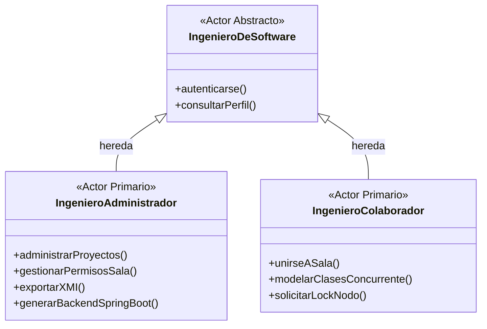
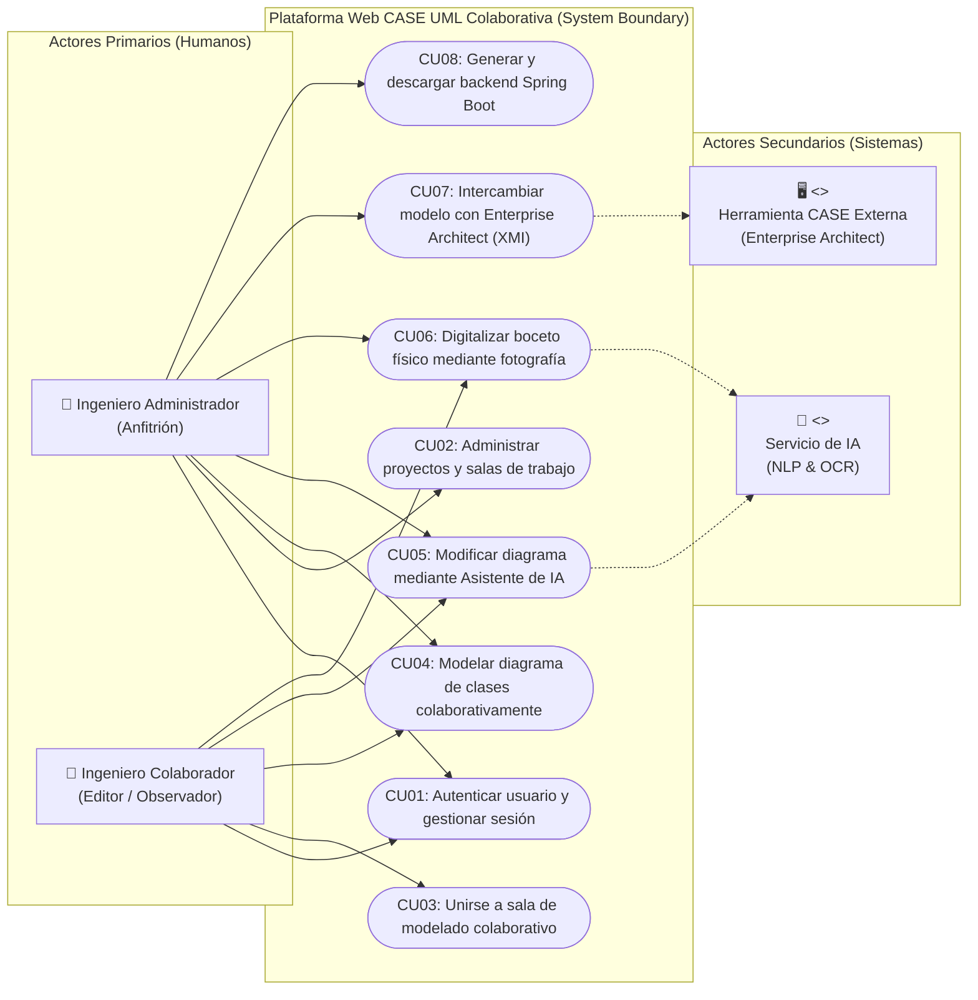

# Especificación Formal de Actores y Catálogo de Casos de Uso

**Proyecto:** Plataforma Web Colaborativa CASE UML Asistida por IA y Generador Backend  
**Materia:** Ingeniería de Software 1 — UAGRM (FICCT)  
**Metodología:** PUDS (Proceso Unificado de Desarrollo de Software)  
**Estándar:** UML 2.5 / ISO 25010  

---

## 1. Contexto Metodológico

Bajo el marco del **Proceso Unificado de Desarrollo de Software (PUDS)**, los actores modelan cualquier entidad externa al sistema informático que interactúa directamente en su frontera (*System Boundary*). Los casos de uso delimitan los servicios de valor observable que el sistema brinda a dichos actores.

En este sistema CASE colaborativo, la arquitectura contempla interacción concurrente humana, asistencia cognitiva automatizada e interoperabilidad de esquemas estándar, estructurados en **Actores Primarios (Humanos)** y **Actores Secundarios (de Sistema)**.

---

## 2. Taxonomía y Definición de Actores

### 2.1. Actores Primarios (Humanos)

Los actores primarios inician los flujos de interacción y obtienen el beneficio directo del sistema:

* **A0. Ingeniero de Software (Actor General / Abstracto):**
  * Representa al profesional que interactúa con la plataforma.
  * Agrupa las capacidades comunes a todos los usuarios del sistema: registro de cuenta, autenticación (`CU01`), navegación general y visualización básica.

* **A1. Ingeniero Administrador (Anfitrión):**
  * **Especialización:** Hereda de *Ingeniero de Software*.
  * **Rol y Responsabilidades:**
    * Propietario de la sala o proyecto (`propietario_id`).
    * Crea, configura, actualiza y archiva proyectos de diseño (`CU02`).
    * Gestiona las salas de modelado, generando el código de invitación (UUID v4) y asignando roles de membresía (`ANFITRION`, `EDITOR`, `OBSERVADOR`).
    * Coordina la interoperabilidad formal del modelo mediante importación/exportación XMI (`CU07`).
    * Es el único actor facultado para ordenar la compilación, generación y descarga del backend en 5 capas Spring Boot (`CU08`).

* **A2. Ingeniero Colaborador:**
  * **Especialización:** Hereda de *Ingeniero de Software*.
  * **Rol y Responsabilidades:**
    * Se incorpora a una sesión de trabajo existente mediante un código de sala UUID compartido (`CU03`).
    * Diseña concurrentemente diagramas de clases UML sobre el lienzo interactivo (`CU04`).
    * Según su rol en la sala:
      * **`EDITOR`:** Adquiere bloqueos de exclusión mutua (*locks*), crea/muta entidades, atributos, métodos y asociaciones.
      * **`OBSERVADOR`:** Inspecciona en tiempo real el diseño conceptual sin capacidad de modificar o bloquear nodos.

---

### 2.2. Actores Secundarios / de Soporte (`<<system>>`)

Los actores secundarios asisten al sistema para completar casos de uso complejos o actúan como sistemas externos receptores/emisores de información:

* **A3. Servicio de Inteligencia Artificial (`<<system>>`):**
  * **Naturaleza:** Microservicio cognitivo externo (FastAPI / Whisper / LLM / Visión por Computadora).
  * **Interacción:**
    * Recibe secuencias de audio o texto en lenguaje natural y las transforma en comandos de mutación estructurada sobre el metamodelo (`CU05`).
    * Recibe capturas fotográficas de diagramas físicos en pizarras o papel y realiza reconocimiento óptico de entidades y atributos (`CU06`).

* **A4. Herramienta CASE Externa (`<<system>>`):**
  * **Naturaleza:** Software industrial de modelado UML (ej. Enterprise Architect, Visual Paradigm, StarUML).
  * **Interacción:** Intercambia el grafo de clases mediante especificaciones serializadas en el estándar industrial **XMI 2.1 / UML 2.5** (`CU07`).

---

### 2.3. Jerarquía y Generalización de Actores

---

## 3. Catálogo Consolidado de Casos de Uso (CU01 al CU08)

### 3.1. Ciclo #1: Fundación Arquitectónica y Modelado Concurrente

| Código | Nombre del Caso de Uso | Actor Primario | Actor Secundario | Descripción Funcional |
|:---:|---|---|---|---|
| **`CU01`** | **Autenticar usuario y gestionar sesión** | Ingeniero de Software | — | Registro con hash `bcrypt`, login seguro, expedición de tokens JWT criptográficos, validación de estado de cuenta (`ACTIVO`, `INACTIVO`, `BLOQUEADO`) y cierre de sesión. |
| **`CU02`** | **Administrar proyectos y salas de trabajo** | Ingeniero Administrador | — | Creación transaccional de proyectos, generación de código público de sala UUID v4, listado con métricas de miembros, edición de metadatos y eliminación o archivado. |
| **`CU03`** | **Unirse a sala de modelado colaborativo** | Ingeniero Colaborador | — | Incorporación del ingeniero a la sala mediante código de invitación UUID, verificación de unicidad de membresía y asignación de rol (`EDITOR` / `OBSERVADOR`). |
| **`CU04`** | **Modelar diagrama de clases colaborativamente (con exclusión mutua)** | Ingeniero Administrador, Ingeniero Colaborador | — | Edición gráfica interactiva sobre lienzo reactivo (Canvas/SVG). Implementa semáforos de bloqueo (*locks*) para evitar colisiones entre colaboradores y autogenera tablas intermedias en relaciones N a N (`*..*`). |

---

### 3.2. Ciclo #2: Inteligencia Artificial, Interoperabilidad y Generador Backend

| Código | Nombre del Caso de Uso | Actor Primario | Actor Secundario | Descripción Funcional |
|:---:|---|---|---|---|
| **`CU05`** | **Modificar diagrama mediante Asistente de IA (Voz / Texto)** | Ingeniero Administrador, Ingeniero Colaborador | Servicio de Inteligencia Artificial | Captura y envío de instrucciones en lenguaje natural (voz o texto); la IA analiza y muta el diagrama atómicamente, auditando la operación en `auditoria_comandos_ia`. |
| **`CU06`** | **Digitalizar boceto físico mediante fotografía** | Ingeniero Administrador, Ingeniero Colaborador | Servicio de Inteligencia Artificial | Carga de fotografía o bosquejo de diagrama de clases dibujado en pizarra; la IA realiza OCR y vectoriza las clases y atributos en la base de datos. |
| **`CU07`** | **Intercambiar modelo con Enterprise Architect (XMI)** | Ingeniero Administrador | Herramienta CASE Externa | Exportación e importación del metamodelo conceptual en formato estándar XMI 2.1 / UML 2.5 garantizando interoperabilidad bidireccional. |
| **`CU08`** | **Generar y descargar arquitectura backend Spring Boot (5 capas)** | Ingeniero Administrador | — | Validación sintáctica del grafo UML, compilación de plantillas Java (Entity, Repository, Service, Controller, DTO con Maven) y empaquetado descargable en archivo ZIP. |

---

## 4. Matriz de Trazabilidad: Actores vs. Casos de Uso

| Caso de Uso | Ingeniero Administrador | Ingeniero Colaborador | Servicio de IA (`<<system>>`) | Herramienta CASE (`<<system>>`) |
|---|:---:|:---:|:---:|:---:|
| **CU01: Autenticar usuario** | Inicia | Inicia | — | — |
| **CU02: Administrar proyectos/salas** | Inicia (Exclusivo) | — | — | — |
| **CU03: Unirse a sala de modelado** | — | Inicia | — | — |
| **CU04: Modelar diagrama de clases** | Inicia (Editor) | Inicia (Editor/Obs) | — | — |
| **CU05: Modificar diagrama por IA** | Inicia | Inicia | Asiste / Procesa | — |
| **CU06: Digitalizar boceto físico** | Inicia | Inicia | Asiste / Procesa | — |
| **CU07: Intercambiar modelo XMI** | Inicia (Exclusivo) | — | — | Emite / Recibe |
| **CU08: Generar backend Spring Boot** | Inicia (Exclusivo) | — | — | — |

---

## 5. Diagrama General de Casos de Uso (UML)

---

## 6. Justificación Técnica para la Documentación PUDS

1. **Denominación «Ingeniero Administrador» frente a «Ingeniero Diseñador»:**
   * Evita ambigüedad semántica: en el sistema, ambos usuarios (anfitrión y colaborador) diseñan diagramas de clases. 
   * Destaca la responsabilidad de gobierno de datos: el administrador es el responsable del ciclo de vida del proyecto, del control de acceso y de la ejecución de operaciones de alto impacto (generación de código y exportación).
2. **Inclusión de Actores Secundarios (`<<system>>`):**
   * En PUDS y UML 2.5, los actores modelan fronteras del sistema. 
   * Representar el **Servicio de Inteligencia Artificial** y la **Herramienta CASE Externa** evidencia que la arquitectura no es monolítica ni cerrada, sino orientada a microservicios e interoperabilidad estandarizada, cumpliendo los atributos de calidad de la norma **ISO/IEC 25010** (Modularidad, Interoperabilidad y Extensibilidad).
