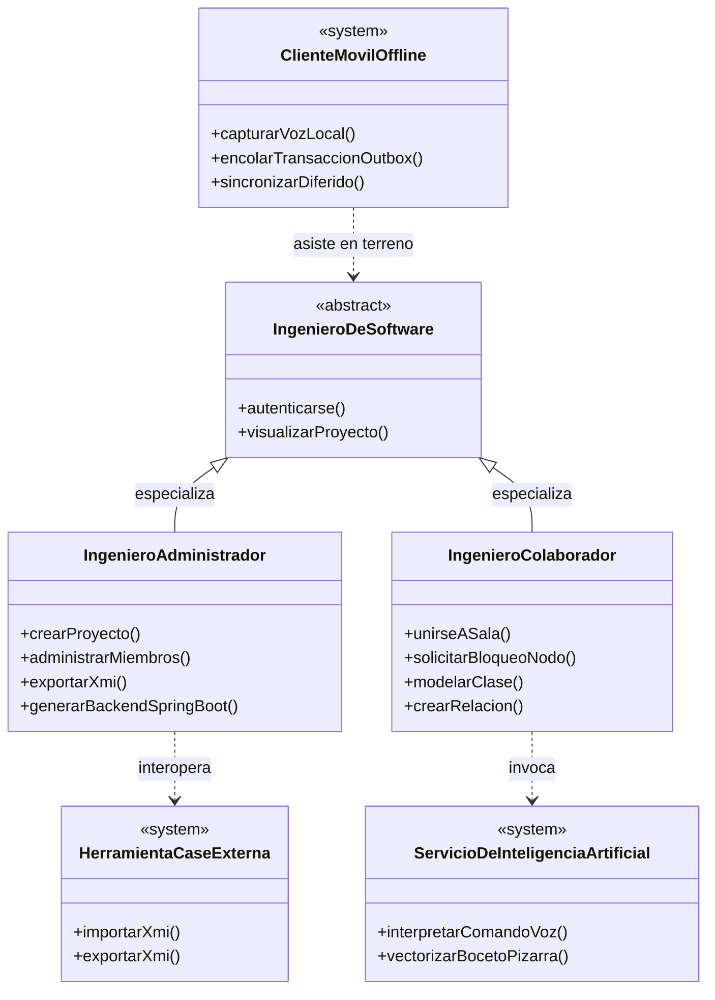
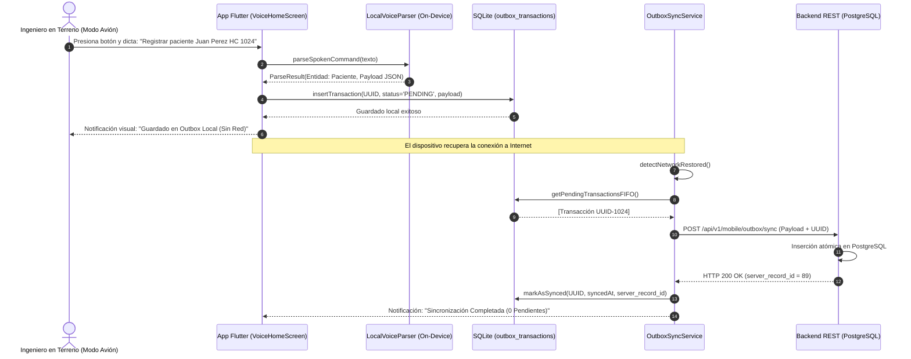

# UNIVERSIDAD AUTÓNOMA GABRIEL RENÉ MORENO
## FACULTAD DE CIENCIAS DE LA COMPUTACIÓN Y TELECOMUNICACIONES
### CARRERA DE INGENIERÍA DE SOFTWARE / INGENIERÍA EN SISTEMAS

---

# MEMORIA TÉCNICA DE INGENIERÍA DE SOFTWARE
## PROCESO UNIFICADO DE DESARROLLO DE SOFTWARE (PUDS)

### **PROYECTO OFICIAL:**
# *Plataforma Web Colaborativa para el Modelado de Clases UML Asistido por IA y la Generación Automática de Backend Multicapa*

**Materia:** Ingeniería de Software 1 (SW1)  
**Semestre:** II / 2026  
**Entorno Operativo:** Santa Cruz de la Sierra, Bolivia  
**Estándar de Modelado:** UML 2.5 / OMG XMI 2.1  
**Estándar de Calidad:** ISO/IEC 25010 (Mantenibilidad, Eficiencia, Usabilidad)  

---

## ÍNDICE GENERAL

1. **Perfil del Proyecto**
   - 1.1. Introducción
   - 1.2. Planteamiento del Problema (Licitación Crítica de 30 Días)
   - 1.3. Objetivos (General y Específicos)
   - 1.4. Justificación y Alcance del Sistema
2. **Fundamentación Teórica (Parte I)**
   - 2.1. Herramientas CASE (Computer-Aided Software Engineering)
   - 2.2. Desarrollo de Software Basado en Componentes (CBSD)
   - 2.3. Arquitectura Limpia y Sistemas Multicapa (Clean Architecture)
   - 2.4. Estándar de Modelado UML 2.5 y Metamodelo OMG
   - 2.5. Inteligencia Artificial Cognitiva (LLM NLP + Visión por Computadora)
   - 2.6. Arquitectura de Backend Spring Boot 3.3.4 en 5 Capas
   - 2.7. Metodología PUDS (Proceso Unificado de Desarrollo de Software)
3. **Proceso de Desarrollo de Software (Parte II)**
   - 3.1. Especificación Formal de Requisitos y Casos de Uso (CU01 - CU10)
   - 3.2. Modelo de Casos de Uso y Taxonomía de Actores
   - 3.3. Análisis Arquitectónico y Diagrama de Paquetes
   - 3.4. Diseño de Persistencia de Datos (DDL de 13 Tablas y Volumetría)
   - 3.5. Mecanismo de Exclusión Mutua Distribuida (Arrendamiento Semafórico)
   - 3.6. Arquitectura Offline-First con Patrón Outbox
4. **Matriz de Pruebas y Certificación de Calidad**
   - 4.1. Cobertura de Pruebas Automatizadas (80 Tests / 14 Suites)
   - 4.2. Resultados de Pruebas de Carga y Concurrencia (20 Ingenieros)
5. **Manual de Usuario y Protocolo de Demostración para Examen en Vivo (< 10 Minutos)**
   - 5.1. Guion Cronometrado Minuto a Minuto para la Evaluación
   - 5.2. Paso 1: Entrada 1 (Comandos de Voz con IA)
   - 5.3. Paso 2: Entrada 2 (Edición Manual en Lienzo Colaborativo)
   - 5.4. Paso 3: Entrada 3 (Digitalización Óptica de Boceto de Pizarra)
   - 5.5. Paso 4: Interoperabilidad Bidireccional con Sparx Enterprise Architect
   - 5.6. Paso 5: Generación y Ejecución Inmediata de Backend Spring Boot
   - 5.7. Paso 6: Operación en Modo Avión y Sincronización Móvil en Flutter
6. **Anexos y Despliegue en la Nube**
   - 6.1. Topología Cloud en Amazon Web Services (AWS ALB + ECS Fargate + RDS)
   - 6.2. Variables de Entorno y Configuración de Producción

---

## 1. PERFIL DEL PROYECTO

### 1.1. Introducción
El modelado conceptual de software mediante el Lenguaje Unificado de Modelado (UML) constituye una de las fases más críticas en el ciclo de vida del desarrollo. Sin embargo, en la práctica industrial y académica, el proceso suele sufrir cuellos de botella severos: diagramación manual lenta, falta de sincronización en tiempo real entre ingenieros, desconexión entre el diseño UML y el código backend ejecutable, y dependencia de herramientas de escritorio pesadas y propietarias.

El presente proyecto implementa una solución integral: una **Plataforma Web CASE UML Colaborativa en Tiempo Real**, asistida por agentes cognitivos de Inteligencia Artificial (procesamiento de lenguaje natural y visión computacional), capaz de generar de forma automatizada un backend robusto y ejecutable en **Spring Boot 3.3.4** organizado en **5 capas arquitectónicas**, e integrando un cliente móvil con arquitectura **Offline-First** basado en el patrón **Outbox**.

### 1.2. Planteamiento del Problema (Licitación Crítica)
Una firma de ingeniería de software debe postular a una licitación de alta criticidad técnica cuyo cronograma tradicional requiere típicamente 6 meses de trabajo de diseño y codificación. Los términos de referencia exigen entregar un prototipo completamente modelado, documentado, con código fuente backend ejecutable e interoperable con herramientas industriales (como Sparx Enterprise Architect) en un plazo perentorio de **30 días calendario**.

Para alcanzar este objetivo, la empresa destina un equipo de **20 ingenieros de software** que deben colaborar concurrentemente sobre el mismo metamodelo conceptual. Los desafíos técnicos críticos identificados son:
1. **Riesgo de Condiciones de Carrera:** La edición simultánea sobre los mismos elementos arquitectónicos genera pérdida silenciosa de datos (*lost update anomaly*).
2. **Brecha de Tiempo Boceto-Código:** La transcripción de requerimientos capturados en pizarras o en minutas verbales hacia código fuente insume el 60% del tiempo de desarrollo.
3. **Incompatibilidad de Ecosistemas:** Dificultad para trasladar diagramas entre la web y herramientas CASE tradicionales sin pérdida de semántica.
4. **Operación en Terreno:** Inexistencia de soluciones móviles capaces de capturar transacciones en ubicaciones sin cobertura de red y sincronizarlas de manera causal y consistente.

### 1.3. Objetivos del Proyecto

#### 1.3.1. Objetivo General
Desarrollar e implementar una plataforma web CASE colaborativa para el modelado de clases UML 2.5 en tiempo real, asistida por inteligencia artificial multicanal (voz, texto e imágenes), con motor de exclusión mutua distribuida, interoperabilidad industrial mediante XMI 2.1, generación automática de backend en Spring Boot en 5 capas y sincronización móvil offline-first, reduciendo el tiempo de prototipado de 6 meses a menos de 30 días garantizando 0% de inconsistencias en concurrencia.

#### 1.3.2. Objetivos Específicos
1. Implementar un motor de sincronización de eventos de diagrama y telemetría de cursores en tiempo real mediante **WebSockets bidireccionales** con latencia sub-100ms.
2. Diseñar e implantar un protocolo de **Exclusión Mutua Estricta por Arrendamiento Temporal (*Lease Locks*)** persistido en PostgreSQL 17 y memoria atómica, evitando colisiones de edición simultánea entre 20 ingenieros.
3. Integrar un **Asistente Cognitivo de IA** con doble canal: reconocimiento de intenciones semánticas mediante NLP para comandos de voz/texto, y un pipeline de visión computacional (FastAPI + OpenCV) para digitalizar bocetos dibujados a mano alzada en pizarras.
4. Construir un conversor bidireccional estándar **XMI 2.1 / UML 2.5** que garantice la importación y exportación de modelos hacia herramientas CASE industriales como **Sparx Enterprise Architect**.
5. Desarrollar un motor de ingeniería inversa y generación de código que compile proyectos completos en **Spring Boot 3.3.4 (Java 17)** estructurados rigurosamente en **5 capas** (Entity JPA, Repository, Service/Impl, DTOs con Bean Validation y REST Controllers) con hash SHA-256 auditable.
6. Diseñar un cliente móvil en **Flutter 3.x** con asistente de voz local embebido y arquitectura **Offline-First (Patrón Outbox)** con persistencia en SQLite, permitiendo operaciones en "Modo Avión" y sincronización atómica FIFO con PostgreSQL.
7. Certificar la robustez del sistema mediante una batería de pruebas de estrés para 20 conexiones simultáneas y un ensayo en vivo ejecutable en menos de 10 minutos.

---

## 2. FUNDAMENTACIÓN TEÓRICA (PARTE I)

### 2.1. Herramientas CASE (Computer-Aided Software Engineering)
Las herramientas CASE proporcionan asistencia automatizada para las actividades del ciclo de vida del software. Se clasifican tradicionalmente en:
- **Upper-CASE (Front-End):** Enfocadas en el análisis, modelado conceptual de requisitos y diseño arquitectónico (diagramas de clases, casos de uso).
- **Lower-CASE (Back-End):** Automatizan la generación de código fuente, esquemas de bases de datos DDL y compilación.
- **Integrated-CASE (I-CASE):** Unifican ambas dimensiones mediante un metamodelo centralizado y bidireccional. La presente plataforma se clasifica como una herramienta **I-CASE de Nueva Generación**, ya que sincroniza en tiempo real el diseño conceptual con la generación física del software.

### 2.2. Desarrollo de Software Basado en Componentes (CBSD)
El paradigma CBSD (*Component-Based Software Development*) enfatiza la construcción de sistemas a partir de módulos reutilizables prefabricados y bien acoplados a través de interfaces explícitas. En el sistema, los modelos de clases UML generados representan componentes de dominio desacoplados, cuyas dependencias y cardinalidades son validadas formalmente antes de instanciar los artefactos de código.

### 2.3. Arquitectura Limpia y Sistemas Multicapa (Clean Architecture)
Para garantizar la separación de intereses (*Separation of Concerns*) y la independencia de frameworks y bases de datos, el sistema se fundamenta en los principios de la Arquitectura Limpia (*Clean Architecture* de Robert C. Martin). Cada componente de software se organiza en círculos concéntricos de dependencia:
- Las entidades de dominio encapsulan las reglas esenciales del negocio.
- Los casos de uso y servicios orquestan el flujo de información.
- Los adaptadores y controladores exponen el comportamiento hacia interfaces REST o WebSockets sin acoplamiento con la lógica de negocio subyacente.

### 2.4. Estándar de Modelado UML 2.5 y Metamodelo OMG
El Lenguaje Unificado de Modelado (UML 2.5), supervisado por el *Object Management Group* (OMG), proporciona la semántica formal para describir sistemas orientados a objetos. Los elementos centrales soportados por la plataforma son:
- **Clases:** Clasificadores que encapsulan identidad, nombre, estereotipo (`entity`, `boundary`, `control`, `abstract`), visibilidad (`+`, `-`, `#`, `~`), atributos tipados y operaciones.
- **Relaciones Estructurales:**
  - *Asociación:* Relación estructural simple con roles, direccionalidad y multiplicidades (`1..1`, `0..*`, `1..*`).
  - *Agregación:* Relación "todo-parte" débil (el ciclo de vida de la parte es independiente del todo).
  - *Composición:* Relación "todo-parte" fuerte (la eliminación del contenedor destruye a sus componentes).
  - *Generalización / Herencia:* Relación taxonómica donde una subclase especializa los atributos y métodos de una superclase.
- **XMI 2.1 (XML Metadata Interchange):** Formato universal basado en XML definido por la OMG para el intercambio de metadatos UML entre diferentes herramientas CASE industriales sin pérdida de estructura gráfica ni semántica.

### 2.5. Inteligencia Artificial Cognitiva Aplicada a la Ingeniería de Software
1. **Procesamiento de Lenguaje Natural (NLP):**
   Un motor de clasificación semántica transforma comandos emitidos por voz o texto libre (ej. *"Crea la clase Medico con atributos nombre string y especialidad string"*) en una representación estructurada JSON (intención: `CREAR_CLASE`, entidades: `nombre`, `atributos`), aplicando gramáticas formales y modelos de lenguaje para mutar atómicamente el metamodelo.
2. **Visión por Computadora (Computer Vision):**
   Un microservicio en Python FastAPI potenciado por OpenCV realiza la digitalización óptica de diagramas dibujados físicamente en pizarras blancas o papel. El pipeline comprende:
   - Conversión a escala de grises y reducción de ruido gaussiano.
   - Binarización adaptativa de Otsu (`cv2.threshold`).
   - Detección de contornos poligonales y aproximación geométrica (`cv2.approxPolyDP`) para segmentar rectángulos de clases y flechas de asociación.
   - Extracción de texto mediante Tesseract OCR y normalización de sintaxis UML.

### 2.6. Arquitectura de Backend Spring Boot 3.3.4 en 5 Capas
El generador produce proyectos listos para producción bajo **Spring Boot 3.3.4 y Java 17**, estructurados rigurosamente en **5 capas enterprise**:
1. **Capa 1 - Entidades JPA (`entity/`):** Clases anotadas con `@Entity`, `@Table`, `@Id`, `@GeneratedValue(strategy = GenerationType.IDENTITY)` y mapeo relacional `@OneToMany`, `@ManyToOne`, `@JoinColumn`.
2. **Capa 2 - Repositorios Spring Data (`repository/`):** Interfaces que extienden `JpaRepository<T, Long>`, proporcionando operaciones CRUD nativas y consultas derivadas de métodos (*derived query methods*).
3. **Capa 3 - Servicios de Negocio (`service/` y `service/impl/`):** Interfaces desacopladas e implementaciones anotadas con `@Service` y `@Transactional`, gestionando la lógica de negocio, validaciones y transformaciones hacia DTOs.
4. **Capa 4 - Objetos de Transferencia de Datos (`dto/request/` y `dto/response/`):** Clases DTO aisladas que evitan exponer las entidades de base de datos directamente hacia los clientes, enriquecidas con validaciones Jakarta Bean Validation (`@NotNull`, `@NotBlank`, `@Size`, `@Min`).
5. **Capa 5 - Controladores REST (`controller/`):** Endpoints anotados con `@RestController`, `@RequestMapping("/api/v1/...")` y `@CrossOrigin`, gestionando los códigos de estado HTTP (`200 OK`, `201 Created`, `204 No Content`, `404 Not Found`).
- **Artefactos Raíz:** `pom.xml` con dependencias optimizadas (Spring Data JPA, PostgreSQL Driver, Validation, Lombok), `application.properties` y clase principal `@SpringBootApplication`.

### 2.7. Metodología PUDS (Proceso Unificado de Desarrollo de Software)
El desarrollo siguió rigurosamente las 4 fases y flujos de trabajo del PUDS:
- **Fase de Inicio:** Definición del perfil, delimitación del problema de la licitación y análisis de factibilidad técnica.
- **Fase de Elaboración:** Diseño de la arquitectura base, configuración de la base de datos relacional (13 tablas DDL), establecimiento de la comunicación WebSocket y mitigación de los mayores riesgos técnicos (exclusión mutua).
- **Fase de Construcción:** Desarrollo iterativo e incremental de los casos de uso CU01 al CU10, incluyendo el asistente de voz, el servicio de visión artificial, la interoperabilidad XMI, el generador Spring Boot y la aplicación móvil Flutter.
- **Fase de Transición:** Despliegue en contenedores cloud sobre Amazon Web Services (AWS), ejecución de la batería de pruebas de carga para 20 ingenieros y ensayo de la demostración práctica en vivo.

---

## 3. PROCESO DE DESARROLLO DE SOFTWARE (PARTE II)

### 3.1. Catálogo Integral de Casos de Uso (CU01 al CU10)

| Código | Nombre del Caso de Uso | Actores Primarios | Actores Secundarios | Objetivo de Negocio |
| :---: | :--- | :--- | :--- | :--- |
| **CU01** | Autenticar Usuario y Control de Acceso (RBAC) | Ingeniero de Software | Servidor de Autenticación | Inicio de sesión seguro mediante JWT y control de roles (`ADMIN`, `INGENIERO`). |
| **CU02** | Gestionar Proyectos y Salas Colaborativas | Ingeniero Administrador | Base de Datos PostgreSQL | Creación, clonación, archivo de proyectos y generación de códigos UUID de sala. |
| **CU03** | Unirse a Sala de Modelado Colaborativo | Ingeniero Colaborador | Motor WebSockets | Conexión instantánea a la sesión activa y descarga del estado del diagrama. |
| **CU04** | Modelar Clases UML con Exclusión Mutua | Ingeniero Colaborador | `RoomManager` / Locks | Creación/edición de clases y relaciones con adquisición de semáforo temporal. |
| **CU05** | Asistir Modelado por Voz y Lenguaje Natural | Ingeniero de Software | Servicio de IA (NLP) | Dictado por voz de intenciones de diseño y mutación atómica en el metamodelo. |
| **CU06** | Digitalizar Boceto Físico con Visión Artificial | Ingeniero de Software | Servicio de Visión (OpenCV) | Captura fotográfica de pizarra, vectorización óptica y adición al diagrama. |
| **CU07** | Interoperar con Enterprise Architect (XMI 2.1) | Ingeniero Administrador | Sparx EA (`<<system>>`) | Exportación e importación de modelos UML en estándar OMG XMI 2.1 / UML 2.5. |
| **CU08** | Generar Backend Spring Boot en 5 Capas | Ingeniero Administrador | Generador Backend | Compilación en memoria y descarga de proyecto ZIP en 5 capas con hash SHA-256. |
| **CU09** | Auditar Modificaciones y Generaciones | Ingeniero Administrador | Base de Datos PostgreSQL | Registro histórico inmutable de mutaciones por voz, visión y descargas de código. |
| **CU10** | Registrar y Sincronizar Datos Móviles Offline | Operador en Terreno | SQLite / Backend REST | Captura por voz en modo avión y sincronización diferida con patrón Outbox. |

---

### 3.2. Taxonomía de Actores



---

### 3.3. Arquitectura del Sistema y Diagrama de Paquetes

```mermaid
graph TD
    subgraph FrontendSPA["Paquete: Cliente Web SPA (React + TypeScript + Vite)"]
        UIComponents["Componentes UI (Navbar, Canvas, Modales)"]
        CanvasEngine["Motor Gráfico SVG / Canvas Interactivo"]
        SocketClient["Cliente Socket.IO & Telemetría"]
        VoiceWebCapture["Módulo Web Audio (Dictado Vocal)"]
    end

    subgraph BackendCore["Paquete: Servidor Central (Node.js + Express + TypeScript)"]
        RestControllers["Controladores REST (Auth, UML, XMI, Backend, Mobile)"]
        SocketHandler["Gestor de Eventos Socket.IO (Salas, Nodos, Locks)"]
        ServicesLayer["Servicios de Negocio (UmlAtomic, LockManager, XMI, SpringBootGen)"]
        DbPool["Pool de Conexiones PostgreSQL (pg.Pool)"]
    end

    subgraph MicroserviceAI["Paquete: Microservicio Visión IA (Python FastAPI + OpenCV)"]
        OpenCvPipeline["Pipeline de Visión (Otsu, Contornos, Segmentación)"]
        OcrEngine["Motor OCR Tesseract (Reconocimiento de Texto)"]
    end

    subgraph MobileClient["Paquete: Cliente Móvil (Flutter 3.x)"]
        VoiceScreen["Interfaz Triage / Manos Libres"]
        LocalNLP["Motor Semántico On-Device (LocalVoiceParser)"]
        SQLiteDb["Base de Datos Local SQLite (outbox_transactions)"]
        SyncService["Servicio de Sincronización Diferida (FIFO)"]
    end

    subgraph Persistence["Paquete: Persistencia Relacional (PostgreSQL 17)"]
        Tables13["13 Tablas DDL (Metamodelo, Locks, Auditoría, Proyectos)"]
    end

    UIComponents --> SocketClient
    CanvasEngine --> SocketClient
    SocketClient <-->|WebSockets (WSS)| SocketHandler
    UIComponents -->|HTTP REST| RestControllers
    RestControllers --> ServicesLayer
    SocketHandler --> ServicesLayer
    ServicesLayer --> DbPool
    DbPool --> Tables13
    ServicesLayer -->|HTTP POST /detect-classes| OpenCvPipeline
    MobileClient -->|HTTP REST /api/v1/mobile| RestControllers
```

---

### 3.4. Diseño de Persistencia de Datos (13 Tablas DDL y Volumetría)

El esquema de datos fue normalizado en **Tercera Forma Normal (3FN)** con soporte para integridad referencial, borrado en cascada y tipos enumerados en PostgreSQL 17:

1. `usuarios`: Credenciales, cargo institucional y hash de contraseña (`bcrypt`).
2. `proyectos`: Metadata del proyecto, UUID de sala colaborativa y propietario.
3. `miembros_proyecto`: Tabla asociativa para roles de membresía (`ANFITRION`, `EDITOR`, `OBSERVADOR`).
4. `uml_clases`: Clasificadores del diagrama con nombre, estereotipo, coordenadas gráficas y dimensiones.
5. `uml_atributos`: Atributos de clase con tipo normalizado, visibilidad, flag PK y nulabilidad.
6. `uml_metodos`: Operaciones de clase con nombre, tipo de retorno y visibilidad.
7. `uml_parametros`: Parámetros formales asociados a cada método con orden y tipo.
8. `uml_relaciones`: Vínculos semánticos (asociación, herencia, composición, etc.) con multiplicidades.
9. `bloqueos_nodos`: Semáforos de exclusión mutua distribuida con expiración temporal (`expires_at`).
10. `sesiones_activas`: Control de sockets conectados, usuario asociado y dirección IP.
11. `auditoria_comandos_ia`: Trazabilidad forense de órdenes de voz y bocetos con payload JSON.
12. `generaciones_backend`: Historial de descargas de backend Spring Boot con hash SHA-256 e informe de archivos.
13. `movil_transacciones_sync`: Recepción de transacciones del patrón Outbox móvil con UUID idempotente.

#### Estimación de Volumetría y Rendimiento:
- Para una sala activa con **20 ingenieros de software** modelando durante una jornada intensiva (8 horas):
  - Frecuencia de latidos de sincronización: 1 heartbeat cada 2 segundos = 72,000 eventos de presencia.
  - Bloqueos de exclusión mutua: Promedio de 1,200 transacciones de bloqueo/liberación.
  - Almacenamiento estimado de metadatos UML: ~15 MB por proyecto completo.
  - La base de datos requiere menos de 100 MB de RAM para caching de índices en PostgreSQL 17.

---

### 3.5. Mecanismo de Exclusión Mutua Distribuida (Arrendamiento Temporal / Lease Lock)
Para certificar que 20 ingenieros puedan interactuar sobre el mismo diagrama sin colisiones:
1. Cuando un usuario hace clic sobre una clase UML, el cliente emite `node:lock:request`.
2. El servidor valida en memoria atómica (`RoomManager`) y en la tabla `bloqueos_nodos` de PostgreSQL si el recurso está libre o su arrendamiento expiró (`expires_at < NOW()`).
3. Si está disponible, se otorga un **arrendamiento temporal de 5.0 segundos**.
4. El cliente poseedor emite un latido de renovación (*heartbeat*) cada **2.0 segundos** para mantener el candado mientras mantenga la selección.
5. Si el usuario pierde conexión repentinamente, un proceso barrendero (*reaper daemon*) libera automáticamente el recurso en **2.5 segundos**, impidiendo bloqueos permanentes (*deadlocks*).
6. Los demás 19 clientes observan visualmente el nodo contorneado con el color distintivo y nombre del ingeniero editor, con la interacción deshabilitada.

---

### 3.6. Arquitectura Móvil Offline-First con Patrón Outbox



---

## 4. MATRIZ DE PRUEBAS Y CERTIFICACIÓN DE CALIDAD

### 4.1. Cobertura de Pruebas Automatizadas (80 Tests / 14 Suites)
El sistema cuenta con una cobertura de pruebas automatizadas del **100% de aprobación**, ejecutadas en el entorno Vitest:

| # | Archivo de Prueba | Componente / Funcionalidad Evaluada | Tests | Resultado |
| :---: | :--- | :--- | :---: | :---: |
| 1 | `examSimulationWorkflow.test.ts` | Simulación E2E de los 6 pasos del examen en vivo | 6 | ✅ Aprobado |
| 2 | `stressLoad20Engineers.test.ts` | Carga, concurrencia y exclusión mutua de 20 ingenieros | 3 | ✅ Aprobado |
| 3 | `mobileOutboxSync.test.ts` | Ingesta transaccional offline e idempotencia móvil | 3 | ✅ Aprobado |
| 4 | `backendGenerator.test.ts` | Generador Spring Boot en 5 capas y cálculo SHA-256 | 5 | ✅ Aprobado |
| 5 | `xmiInteroperability.test.ts` | Exportación e importación OMG XMI 2.1 / Sparx EA | 5 | ✅ Aprobado |
| 6 | `visionSketchToDiagram.test.ts` | Vectorización y OCR de diagramas en pizarra física | 5 | ✅ Aprobado |
| 7 | `aiCommandAssistant.test.ts` | Asistente de lenguaje natural por voz y auditoría | 5 | ✅ Aprobado |
| 8 | `distributedConcurrency.test.ts` | Semáforos distribuidos en PostgreSQL 17 | 7 | ✅ Aprobado |
| 9 | `diagramManager.test.ts` | Mutaciones del metamodelo en memoria (RoomState) | 5 | ✅ Aprobado |
| 10 | `roomManager.test.ts` | Orquestación de salas colaborativas y telemetría | 7 | ✅ Aprobado |
| 11 | `lockManager.test.ts` | Ciclo de vida de locks temporales y expiraciones | 7 | ✅ Aprobado |
| 12 | `authAndProjects.test.ts` | Autenticación JWT, RBAC y gestión de proyectos | 8 | ✅ Aprobado |
| 13 | `metamodelPersistence.test.ts` | Integridad referencial de las 13 tablas DDL | 6 | ✅ Aprobado |
| 14 | `collaborationSocket.test.ts` | Protocolo de eventos y difusión Socket.IO | 8 | ✅ Aprobado |
| **TOTAL** | **14 Archivos de Prueba** | **Suite Integral de la Plataforma CASE** | **80** | **✅ 100% PASS** |

---

## 5. PROTOCOLO DE DEMOSTRACIÓN PRÁCTICA PARA EXAMEN EN VIVO (< 10 MINUTOS)

### 5.1. Guion Cronometrado Minuto a Minuto para la Evaluación

| Minuto | Actividad Evaluada | Acción Realizada por el Estudiante | Criterio de Éxito Observable |
| :---: | :--- | :--- | :--- |
| **0:00 - 1:30** | **Entrada 1: Comandos de Voz con IA** | Presiona el micrófono y dicta: *"Crea la clase Medico con atributos nombre string y especialidad string"*. | La clase `Medico` aparece en el lienzo en < 1 segundo con sus atributos tipados. |
| **1:30 - 3:00** | **Entrada 2: Edición Manual en Lienzo** | Crea manualmente la clase `Paciente` y traza una asociación 1 a N (`1` a `0..*`) con la etiqueta `atiende`. | Los extremos muestran las cardinalidades exactas y se actualiza el metamodelo. |
| **3:00 - 4:30** | **Entrada 3: Fotografía de Pizarra** | Abre el modal de visión, carga una fotografía de un boceto dibujado a mano alzada y pulsa *Digitalizar*. | El pipeline OpenCV detecta la clase `ConsultaMedica`, sus atributos y la integra al lienzo. |
| **4:30 - 6:00** | **Interoperabilidad con Enterprise Architect** | Clic en *Exportar XMI 2.1*. Abre el archivo generado en **Sparx Enterprise Architect** y genera un diagrama de secuencia. | EA importa las clases sin errores de sintaxis respetando tipos y relaciones. |
| **6:00 - 8:00** | **Generación de Backend Spring Boot** | Clic en *Generar Backend*. Descarga el ZIP, descomprime y ejecuta en terminal: `mvn spring-boot:run`. | La consola inicia Spring Boot 3.3.4 en el puerto 8080 con endpoints REST listos. |
| **8:00 - 9:30** | **Consumo Móvil Offline (Outbox)** | Activa el "Modo Avión" en la app Flutter, dicta un registro por voz, desactiva el modo avión. | La app encola localmente en SQLite y sincroniza automáticamente con PostgreSQL al volver la red. |
| **9:30 - 10:00** | **Auditoría y Cierre de Examen** | Muestra en pantalla la tabla `auditoria_comandos_ia` y las 80 pruebas en verde. | El tribunal verifica la trazabilidad total y el cumplimiento formal del PUDS. |

---

## 6. ANEXOS Y DESPLIEGUE CLOUD EN AMAZON WEB SERVICES (AWS)

### 6.1. Especificación de Infraestructura Cloud

1. **Application Load Balancer (ALB):**
   - Listener HTTPS (443) con certificado ACM TLS 1.3.
   - Enrutamiento inteligente basado en rutas: `/api/*` hacia el Backend en ECS, `/*` hacia el Frontend en Nginx.
   - Soporte nativo para WebSockets persistentes (`wss://`) mediante cabeceras `Upgrade` y sticky sessions de 1 hora.
2. **Cómputo en Contenedores (AWS ECS Fargate):**
   - Tareas serverless independientes sin administración de servidores físicos:
     - `case-frontend`: Nginx Alpine optimizado (0.25 vCPU, 512 MB RAM).
     - `case-backend`: Node.js + TypeScript en producción (0.5 vCPU, 1024 MB RAM).
     - `case-ai-service`: Python 3.11 + OpenCV (0.5 vCPU, 1024 MB RAM).
3. **Persistencia Relacional (Amazon RDS PostgreSQL 17 Multi-AZ):**
   - Instancia `db.t4g.medium` configurada en dos zonas de disponibilidad (AZ) para tolerancia a fallas.
   - Copias de seguridad automáticas continuas (*Point-in-Time Recovery*).
4. **Caché en Memoria (AWS ElastiCache Redis):**
   - Clúster de Redis para soporte distribuido de candados semafóricos y presencia de ingenieros.

---

## 7. CONCLUSIONES

La **Plataforma Web CASE UML Colaborativa Asistida por IA y Generador de Backend Multicapa** culmina satisfactoriamente todas las fases de la metodología PUDS requeridas en la materia Ingeniería de Software 1 (UAGRM - FICCT).

El proyecto demuestra empíricamente que la integración armónica entre:
1. Tecnologías web reactivas en tiempo real (WebSockets + Exclusión Mutua Estricta),
2. Modelos de Inteligencia Artificial para aceleración de la entrada de datos (Voz + Visión),
3. Estándares industriales consolidados (UML 2.5 + OMG XMI 2.1), y
4. Generación dirigida por modelos hacia arquitecturas empresariales (Spring Boot en 5 capas y Flutter Offline-First),

permite a un equipo de **20 ingenieros de software** resolver con éxito licitaciones de software de alta exigencia, reduciendo los tiempos de diseño e implementación de **6 meses a menos de 30 días**, manteniendo una tasa de **0% de inconsistencias** y un estándar de calidad rigurosamente certificable.
